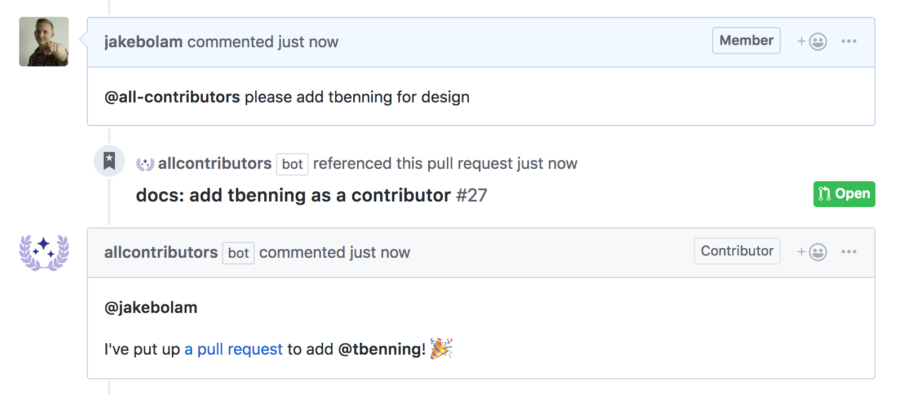

# Hello, @all-contributors bot 🤖

[](https://circleci.com/gh/all-contributors/all-contributors-bot)
[](https://codecov.io/github/all-contributors/all-contributors-bot)
[](https://greenkeeper.io/)
[](#contributors)
[](https://join.slack.com/t/all-contributors/shared_invite/enQtNTE3ODMyMTA4NTk0LTUwZDMxZGZkMmViMzYzYzk2YTM2NjRkZGM5Yzc0ZTc5NmYzNWY3Y2Q0ZTY3ZmFhZDgyY2E3ZmIzNWQwMTUxZmE)

A bot for automatically adding all-contributors.

<a href="#Usage"></a>

## Installation
1. [Install the GitHub App](https://github.com/apps/allcontributors/installations/new) and configure your repositories
<a href="https://github.com/apps/allcontributors/installations/new">
    
</a>

## Usage

### Adding contributions
 Comment on Issue or Pull Request, asking @all-contributors to add a contributor:
```
@all-contributors please add @jakebolam for infrastructure, tests and code
```

The bot will then create a Pull Request to add the contributor, then reply with the pull request details.

> Your request to the bot doesn't need to be perfect. The bot uses some basic Natural Language Parsing to determine your intent, for more information on acceptable messages [visit the @all-contributors website](https://all-contributors.js.org/docs/bot).


### Contribution Types
If you want to know more about the types you can recognize for, [check out the reference key](https://all-contributors.js.org/docs/reference).

## Contributing to the @all-contributors bot
If you have suggestions for how the @all-contributors bot could be improved, or want to report a bug, [open an issue](https://github.com/all-contributors/all-contributors-bot/issues)!

For more, check out the [Contributing Guide](CONTRIBUTING.md).

## Contributors, bot builders

Thanks goes to these wonderful people ([emoji key](https://github.com/all-contributors/all-contributors#emoji-key)):

<!-- ALL-CONTRIBUTORS-LIST:START - Do not remove or modify this section -->
<!-- prettier-ignore -->
| [<br /><sub><b>Jake Bolam</b></sub>](https://jakebolam.com)<br />[💻](https://github.com/all-contribtuors/bot/commits?author=jakebolam "Code") [🤔](#ideas-jakebolam "Ideas, Planning, & Feedback") [🚇](#infra-jakebolam "Infrastructure (Hosting, Build-Tools, etc)") [⚠️](https://github.com/all-contribtuors/bot/commits?author=jakebolam "Tests") | [<br /><sub><b>tbenning</b></sub>](https://github.com/tbenning)<br />[🎨](#design-tbenning "Design") | [<br /><sub><b>Jeff Wen</b></sub>](https://sinchang.me)<br />[⚠️](https://github.com/all-contribtuors/bot/commits?author=sinchang "Tests") [💻](https://github.com/all-contribtuors/bot/commits?author=sinchang "Code") | [<br /><sub><b>Greenkeeper[bot]</b></sub>](https://github.com/apps/greenkeeper)<br />[🚇](#infra-Greenkeeper[bot] "Infrastructure (Hosting, Build-Tools, etc)") | [<br /><sub><b>allcontributors[bot]</b></sub>](https://github.com/apps/allcontributors)<br />[📖](https://github.com/all-contribtuors/bot/commits?author=allcontributors[bot] "Documentation") | [<br /><sub><b>Maximilian Berkmann</b></sub>](http://maxcubing.wordpress.com)<br />[💻](https://github.com/all-contribtuors/bot/commits?author=Berkmann18 "Code") | [<br /><sub><b>Bex Warner</b></sub>](http://hiimbex.com)<br />[💻](https://github.com/all-contribtuors/bot/commits?author=hiimbex "Code") |
| :---: | :---: | :---: | :---: | :---: | :---: | :---: |
<!-- ALL-CONTRIBUTORS-LIST:END -->

This project follows the [all-contributors](https://github.com/all-contributors/all-contributors) specification. Contributions of any kind welcome

## LICENSE

[MIT](LICENSE)
