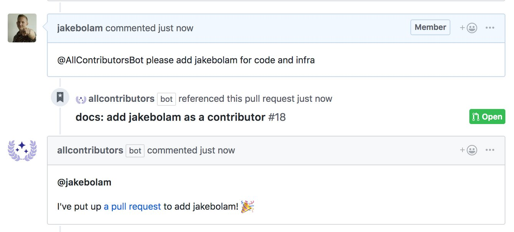

# AllContributorsBot

A bot for automatically adding all-contributors. 🤖

## Installation
1. Install App
2. Please setup your `README.md` and `.all-contributorsrc` using the [all-contributors-cli tool](https://github.com/all-contributors/all-contributors-cli)
> In the future we want to remove the need for the CLI tool, if you want to help out [see the issue](https://github.com/all-contributors/all-contributors-bot/issues/3)

## Usage

### Adding contributions
1. Comment on Issue/PR etc with text: `@AllContributorBot please add jakebolam for infrastructure, testing and code` (Can also use the short terms, full key coming soon)
2. Bot will look for `.all-contributorsrc` if not found, comments on pr to run setup
3. If user exists, add new contribution, if not add user and add contribution

## Contributing
If you have suggestions for how the AllContributorsBot could be improved, or want to report a bug, [open an issue](https://github.com/all-contributors/all-contributors-bot/issues)!

For more, check out the [Contributing Guide](CONTRIBUTING.md).

## Contributors

Thanks goes to these wonderful people ([emoji key](https://github.com/all-contributors/all-contributors#emoji-key)):

<!-- ALL-CONTRIBUTORS-LIST:START - Do not remove or modify this section -->
<!-- prettier-ignore -->
| [ <b>Jake Bolam</b>](https://jakebolam.com) [💻](https://github.com/all-contribtuors/bot/commits?author=jakebolam "Code") [🤔](#ideas-jakebolam "Ideas, Planning, & Feedback") [🚇](#infra-jakebolam "Infrastructure (Hosting, Build-Tools, etc)") [⚠️](https://github.com/all-contribtuors/bot/commits?author=jakebolam "Tests") |
| :---: |
<!-- ALL-CONTRIBUTORS-LIST:END -->

This project follows the [all-contributors](https://github.com/all-contributors/all-contributors) specification. Contributions of any kind welcome

## LICENSE

[MIT](LICENSE)
