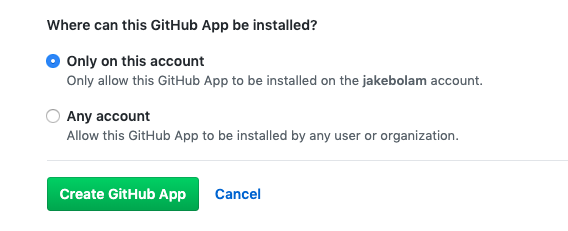
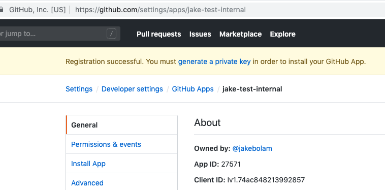
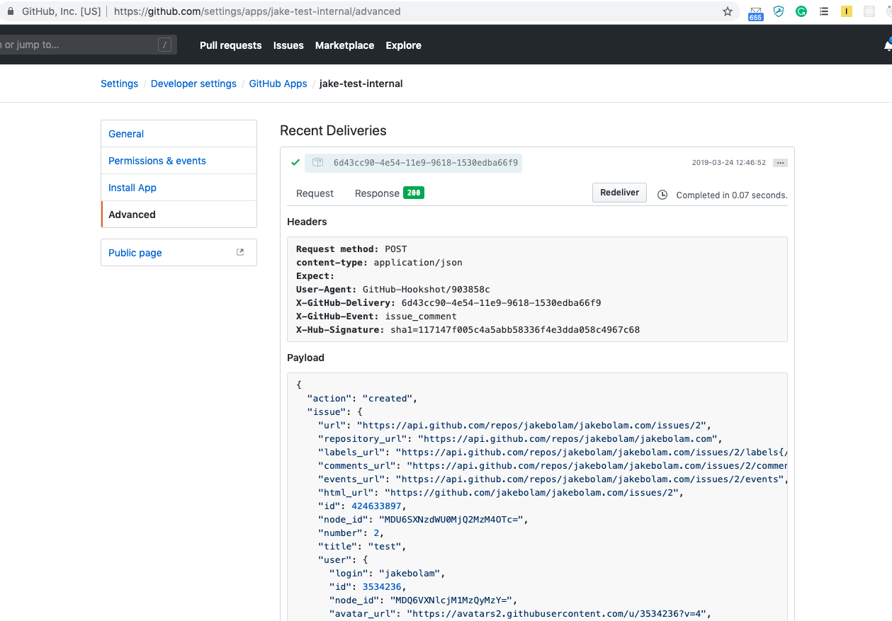

# Local Bot Setup
> *IMPORTANT*: Please uninstall the production bot from your user account before continuing (otherwise multiple bots will respond to your comments)

To get your app running against GitHub

## 1. Create a GitHub App for testing
### 1.1 Go to your github [developer settings](https://github.com/settings/developers)
### 1.2 Create a [new github app](https://github.com/settings/apps/new)
Required fields are:
- `name`, which can be whatever you like, globally unique on github
- `homepage url`, which can be set to anything
- `webhook url`, which can be set to anything

Important fields are:
- `webhook secret`, set this to `development`
- `Permissions` which should we set [as defined in the app.yml](https://github.com/all-contributors/all-contributors-bot/blob/master/app.yml#L54), e.g. set read & write for `Repository contents`, `Issues` and `Pull Requests`, and read for `Repository Metadata`
- `Subscrive to Events` which should we set [as defined in the app.yml](https://github.com/all-contributors/all-contributors-bot/blob/master/app.yml#L15), e.g. check the checkbox for `Issue comment`
- Ensure `Where can this GitHub App be installed?` is set to `only this account`


## 2. Configure Your GitHub App for testing
You should now have an app created


- On the General Tab, Click `Generate Private Key` and download it for later usage, call it something like `allcontributorsbot.pem`
- On the Install Tab, Install the app/bot on your user


## 3. Configure Your local to talk to the github app
Copy `.env.example` and name it `.env`, replace the following lines with content from above.
```
APP_ID=
WEBHOOK_SECRET=development
PRIVATE_KEY=
```
- `APP_ID`, you can get this from the General tab on the developer settings for your app
- `WEBHOOK_SECRET`, leave as development (you set this on app setup)
- `PRIVATE_KEY` when you generated the private key from your app, you should have a `allcontributorsbot.pem` file locally (or similar). run `openssl base64 < allcontributorsbot.pem | tr -d '\n' | pbcopy` on the file which will copy the base64 contents onto your clipboard, paste that into the line for `PRIVATE_KEY`

## 4. Setup a test github repository/with issues PR
- Setup a repostiory under your name (the name on github where the bot is installed)
- Enable issues and pull reuqests
- Create an issue
- Comment on the issue: `@all-contributors please add @jakebolam for design` (replace @jakebolam with your username)

To verify if the bot should have seen this goto [your app settings](https://github.com/settings/apps/). On the Advaced Tab, Click the most recent deliever to see the payload. It should look something like this:
. Copy the payload and save it locally in a file called `test-webhook-payload.json`


## 5. Send your first hook
1. Install the node modules for the bot`yarn install`
2. Run the bot `yarn start`
3. Curl the bot (or use postman, with 2 headers and the content from `test-webhook-payload.json`)
If you're using curl it would look like:
```
curl -vX POST http://localhost:3000/ -d @test-webhook-payload.json \
--header "Content-Type: application/json" \
--header "X-GitHub-Event: issue_comment"
```

If there are no errors in the bot console, check your github test issue to see the bot respond :tada:
